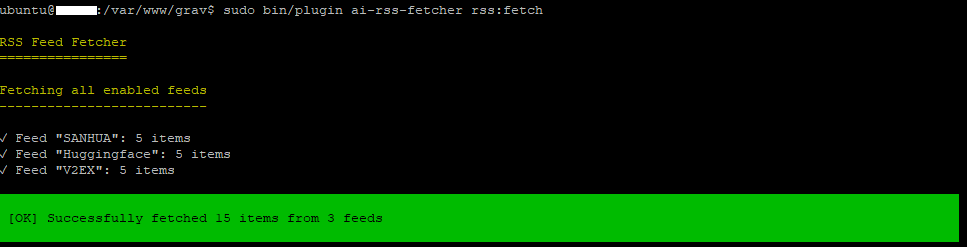

# ai-rss-fetcher

Grav 插件：自动抓取外部 RSS 源并以 Modular 页面形式缓存与展示。支持 CLI 抓取、可配置 RSS 源、Markdown 存储与 Bootstrap 卡片式前端渲染。

---

## 📦 插件功能

- ✅ **RSS 抓取**：使用 [Feed-io](https://github.com/alexdebril/feed-io) 获取并解析外部 RSS 源
- ✅ **CLI 命令**：通过 `bin/plugin rss:fetch` 抓取并缓存 RSS
- ✅ **缓存为 Markdown**：每条 RSS 转为独立 `item.md` 文件，作为 modular 子模块
- ✅ **Bootstrap 卡片展示**：前端以卡片形式展示每条 RSS 摘要、图片和链接
- ✅ **可配置**：通过配置文件自定义 RSS 源、缓存路径、抓取数量等

---

## 📦 安装

```bash
cd user/plugins
git clone https://github.com/acconf/grav-plugin-ai-rss-fetcher.git ai-rss-fetcher
cd ai-rss-fetcher
composer install
```

## 📂 插件目录结构

```text
ai-rss-fetcher/
├── ai-rss-fetcher.php                 # 主插件文件
├── ai-rss-fetcher.yaml                # 默认配置
├── blueprints.yaml                    # 后台蓝图配置
├── bin/
│   └── plugin                         # CLI 命令入口
├── cli/
│   └── FetchRssCommand.php           # CLI 命令实现
├── classes/
│   ├── RssFetcher.php                # RSS 抓取器
│   └── ContentGenerator.php         # Markdown 文件生成器
├── templates/
│   ├── partials/
│   │   └── rss_item.html.twig        # RSS 条目显示模板
│   └── rss_display.html.twig         # 可选整页展示模板
├── css/
│   └── ai-rss-fetcher.css            # 前端样式
├── js/
│   └── ai-rss-fetcher.js             # JS 资源（如需）
├── languages/
│   └── en.yaml                       # 英文翻译
├── CHANGELOG.md
├── LICENSE
└── README.md                         # 当前文件
```

## 🧪 使用方法
### 1. 运行抓取命令
使用 Grav CLI 抓取并缓存 RSS 内容：

```bash
bin/plugin ai-rss-fetcher rss:fetch
```
每条 RSS 会被缓存为：

```bash
/user/pages/modular/_rss/<hash>/item.md
```
同时自动生成或更新：

```swift
/user/pages/modular/_rss/modular.md
```
确保 modular 页面启用，并配置正确的 @self.modular 集合。

### 2. 配置首页显示 RSS 摘要
在首页模板（例如 /themes/your-theme/templates/default.html.twig 或 partials/home.html.twig）中插入以下 Twig 代码：

```twig


  
    
  

```
### 3. Twig 模板：partials/rss_item.html.twig
示例模板内容（可修改为你自己的风格）：

```twig
<div class="card mb-3">
  
    
  
  <div class="card-body">
    <h5 class="card-title">{{ page.title }}</h5>
    <p class="card-text">{{ page.header.excerpt }}</p>
    <a href="{{ page.header.link }}" class="btn btn-primary" target="_blank">阅读全文</a>
  </div>
</div>
```
### 4. RSS Modular 页面的 modular.md 示例
```yaml
---
title: AI News RSS 聚合
visible: false
routable: false
cache_enable: true
template: modular
content:
    items: '@self.modular'
    order:
        by: date
        dir: desc
---
```

## ⚠️ 注意事项
### 1.该Plugin基于Grav v1.7.48开发，因此务必确认依赖组件的版本
⚠️ 注意：请锁定 Symfony/console 版本为 5.0以下，避免与 Grav CLI 的兼容性问题。
```json
  "require": {
    "php": ">=7.4",
    "debril/feed-io": ">=4.9 <5.0",
    "symfony/console": ">=4.4 <5.0",
    "symfony/dom-crawler": ">=2.7 <5.0"
  }
```
### 2.modular 页面目录 /modular/_rss/ 必须包含一个 modular.md

### 3.抓取前建议运行 bin/grav clear-cache

#### □可以通过插件画面配置RSS源


#### □可以通过CLI执行
